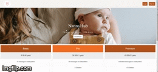
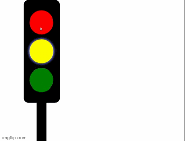
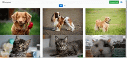

<b>[About](./about.html)</b> | <b>[Projects](./projects.html)</b> | <b>[Resume](./resume.html)</b>

# Projects

 >
 >
Here's a small list of the projects that I've done but you may find plenty more on my <a href="https://github.com/MaiCodes-exe"> GitHub</a> profile

<section></section>

## NannyHub Website
* Tech used: HTML, CSS, BootStrap and JavaScript
Here's what the project looks like:

 

<section></section>

## Traffic Light
* Tech used: HTML, CSS and JavaScript
Here's what the project looks like:

 

<section></section>

## Waving Penguin
* Tech used: HTML, CSS
Here's what the project looks like:

 

<section></section>

## Instagram Feed
* Tech used: HTML, CSS
Here's what the project looks like:

 

<section></section>

## City Skyline
* Tech used: HTML, CSS

Here's what the project looks like:

 
