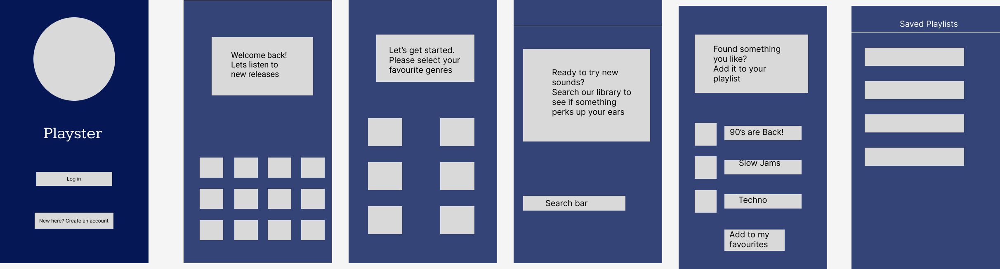
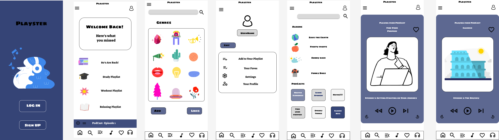
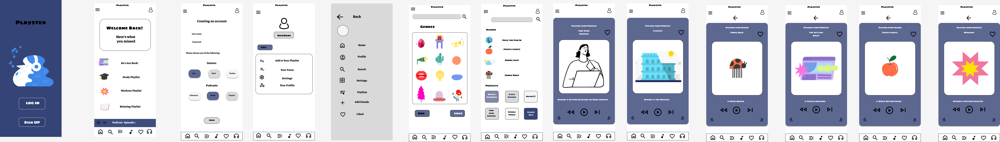
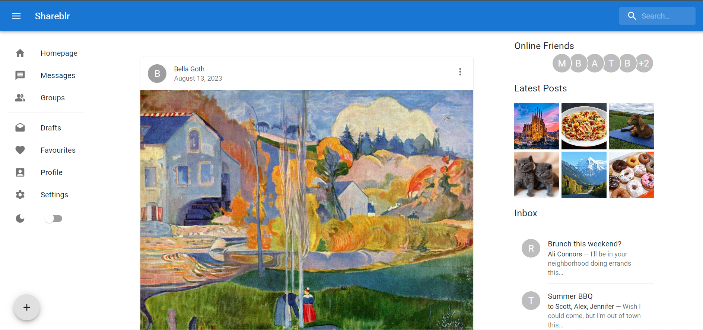
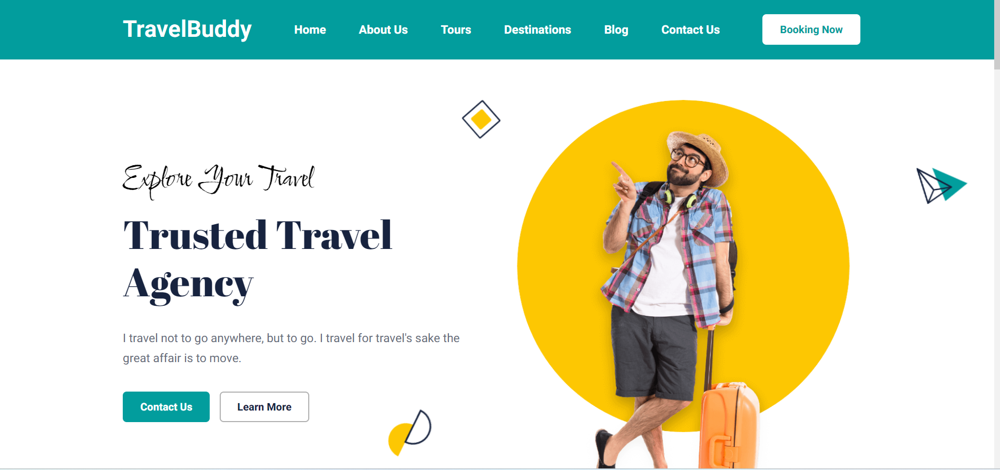
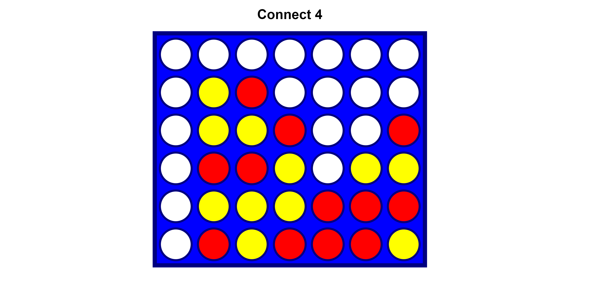
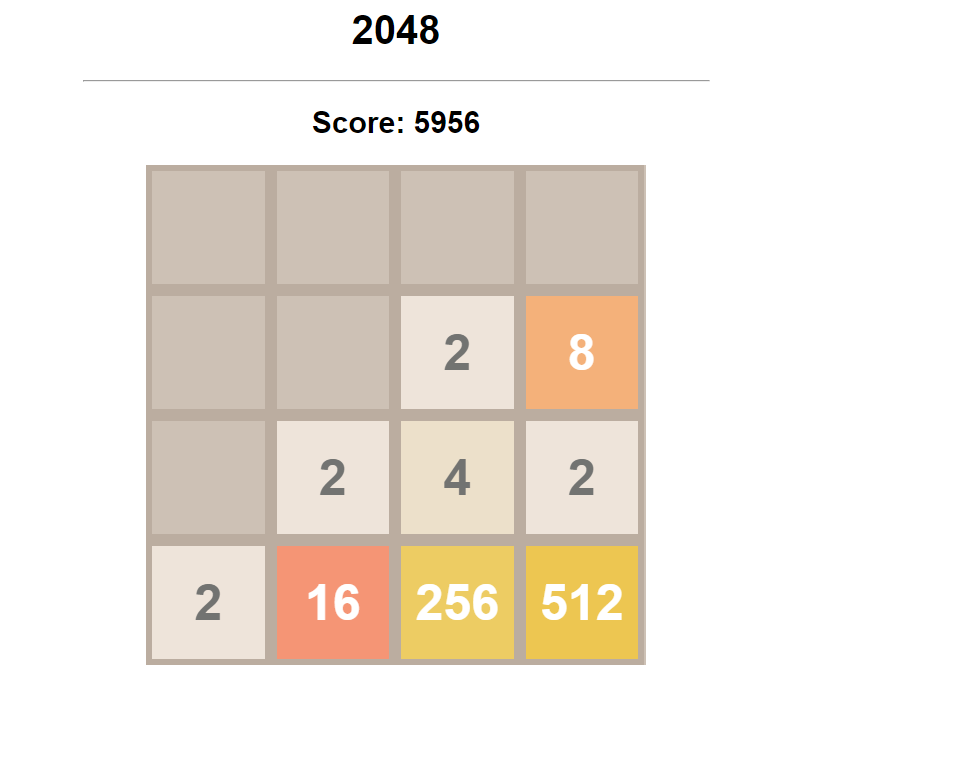
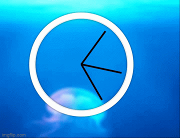

<b>[About](./index.md)</b> | <b>[Resume](./resume.html)</b> | <b>[Projects](./projects.html) </b>

# Projects

 >
 >
Here's a small list of the projects that I've done but you may find plenty more on my <a href="https://github.com/MaiCodes-exe"> GitHub</a> profile

<section></section>

## UX/UI Music Player Project [ON GOING PROJECT]
* Tech used: Figma

 This a music player project that I created for my Google UX/UI certification, from the first low fidelity wireframe to the latest version

This is the very first wireframe I have done for this project:

 

This is a second version of the UI. I choose to use a cartoonish approach rather than use a more realistic theme:

 

This is a third version of the UI. I added a more frames to improve to workflow of the app:

 

<section></section>

## NannyHub Website 

 GitHub Repository <a href="https://github.com/nannyhub/NannysHub">[Link]</a>

* Tech used: HTML, CSS, BootStrap and ReactJs.

This is a collaborative project made by me and the rest of my group during the bootcamp but I did the majority of the front-end and the design of the website

Here's what the project looks like:

 

<section></section>

## Shareblr <a href="https://shareblr-maicodes-exe.vercel.app/">[Link]</a>

 GitHub Repository <a href="https://github.com/MaiCodes-exe/socialmockup">[Link]</a>

* Tech used: ReactJS and MaterialUI 

This is a mock up project of a social media platform

Here's what the project looks like:

 

<section></section>

## TravelBuddy <a href="https://travelsitemockup.netlify.app/">[Link]</a>

 GitHub Repository <a href="https://github.com/MaiCodes-exe/mockup">[Link]</a>

* Tech used: HTML, CSS, BootStrap  and JavaScript

This is a mock up project of a travel website

Here's what the project looks like:

 

<section></section>

## Conect Four <a href="https://connect-four-javascript-game.netlify.app/">[Link]</a>

 GitHub Repository<a href="https://github.com/MaiCodes-exe/connect-four">[Link]</a>

* This project is a classic game that uses HTML, CSS, JavaScript and Dom manipulation to determine which player is the first to connect 4 chips of the same color.

Here's what the project looks like:

 

<section></section>

## 2048 <a href="https://2048javacriptgame.netlify.app/"> [Link]</a>

 GitHub Repository<a href="https://github.com/MaiCodes-exe/2048"> [Link]</a>

* This project is a classic sliding game that uses HTML, CSS, JavaScript loops and Dom. In this game the player must use the arrows keys in the keyboard to combine the tiles to reach the 2048 tile and win.

Here's what the project looks like:

 

<section></section>

## Instagram Feed <a href="https://bootstrapinstafeed.netlify.app/"> [Link]</a>

 GitHub Repository <a href="https://github.com/MaiCodes-exe/BootstrapInstagramFeed">[Link]</a>

* Tech used: HTML, CSS and Bootstrap

Here's what the project looks like:

 

<section></section>

## Clock 

 GitHub Repository <a href="https://github.com/MaiCodes-exe/clock">[Link]</a>

* Tech used: HTML, CSS and JavaScript

Here's what the project looks like:

 
<section></section>

## Waving Penguin 

 GitHub Repository <a href="https://github.com/MaiCodes-exe/wavingPenguin">[Link]</a>

* Tech used: HTML, CSS

Here's what the project looks like:

 

<section></section>

## City Skyline 

 GitHub Repository<a href="https://github.com/MaiCodes-exe/CitySkyline">[Link]</a>

* Tech used: HTML, CSS

Here's what the project looks like:

 
<section></section>

## Traffic Light 

 GitHub Repository<a href="https://github.com/MaiCodes-exe/trafficlightJSX">[Link]</a>

* Tech used: HTML, CSS and JavaScript

Here's what the project looks like:

 

<section></section>
